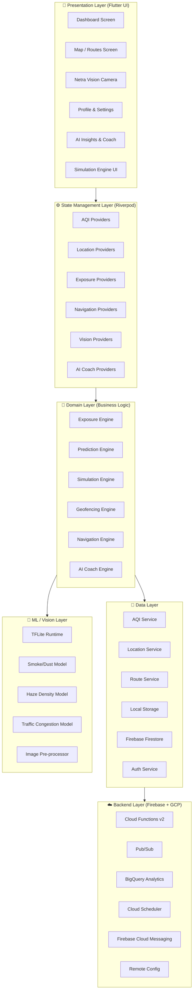
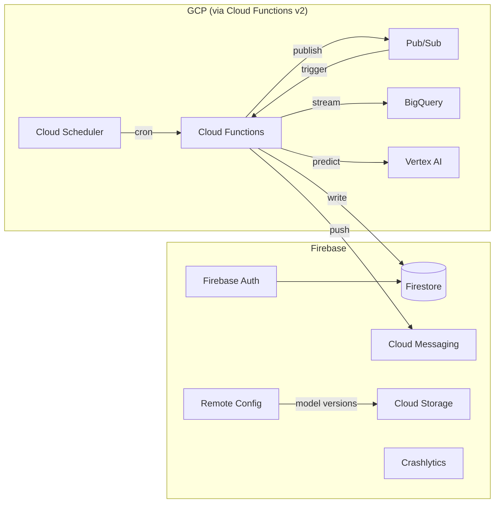
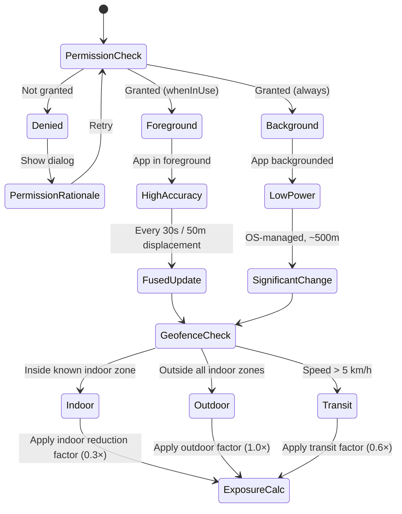
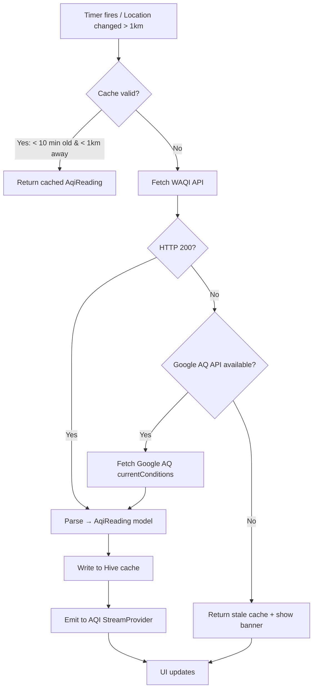
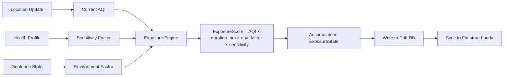
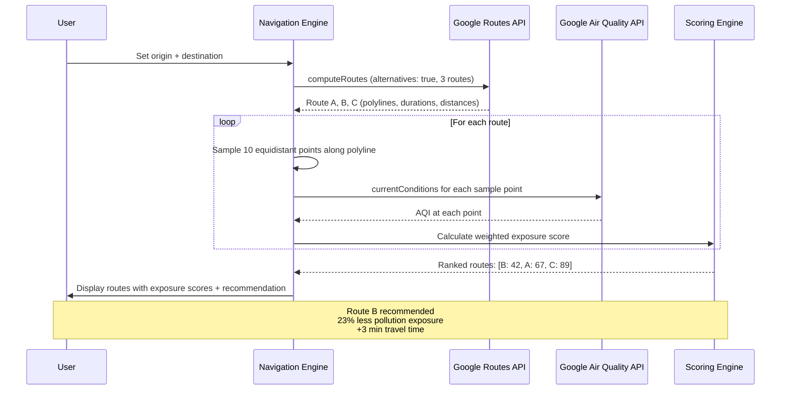
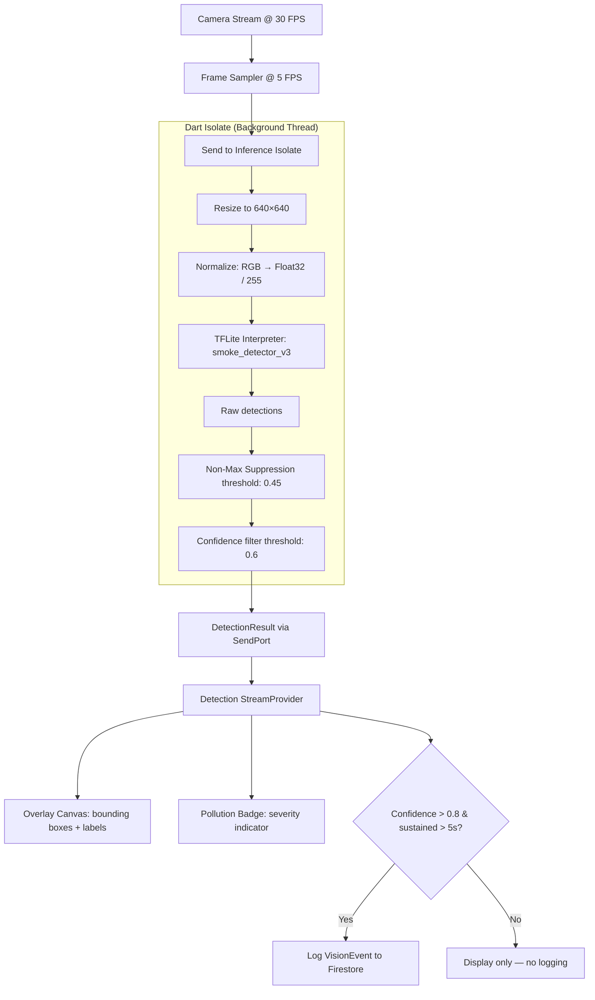
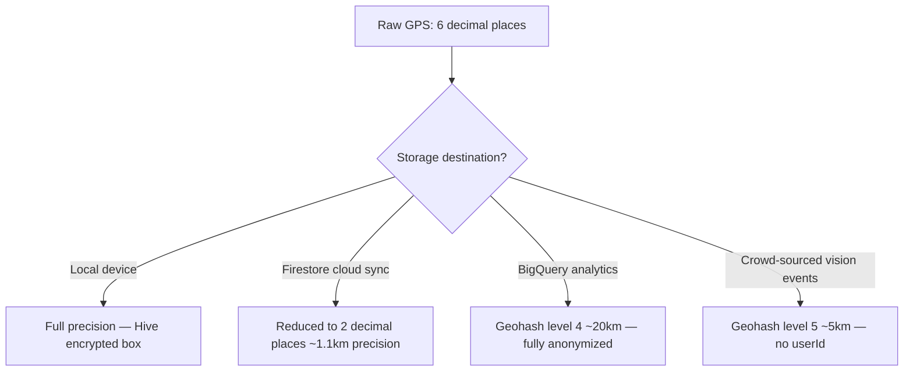

# VAYU — System Architecture & Engineering Blueprint

> *"A Personal Air Health Intelligence System"*

---

## Table of Contents

1. [System Architecture](#1-system-architecture)
2. [Data Flow](#2-data-flow)
3. [Module Breakdown](#3-module-breakdown)
4. [Tech Stack Justification](#4-tech-stack-justification)
5. [Scalability Plan](#5-scalability-plan)
6. [Failure Handling](#6-failure-handling)
7. [Security & Privacy](#7-security--privacy)

---

## 1. System Architecture

### 1.1 — Layered Architecture Overview



### 1.2 — Presentation Layer

| Screen | Purpose | Key Widgets |
|---|---|---|
| **Dashboard** | Real-time AQI, personal exposure score, health status | `AqiGaugeWidget`, `ExposureTrendChart`, `HealthStatusCard` |
| **Map / Routes** | Pollution heatmap overlay, low-exposure route planning | `GoogleMap` + AQ heatmap tiles, `RouteComparisonPanel` |
| **Netra Vision** | Camera-based pollution detection | `CameraPreview`, `DetectionOverlayCanvas`, `PollutionBadge` |
| **AI Insights** | Predictive analytics, recovery plans, coaching | `ForecastChart`, `RecoveryPlanTimeline`, `CoachChatBubble` |
| **Simulation** | "What-if" behavior scenarios | `ScenarioSliders`, `ExposureDeltaGraph` |
| **Profile** | Health factors, preferences, consent management | `HealthProfileForm`, `ConsentToggleGroup` |

**Design Principles:**
- Skeleton loading states for every async widget
- Offline-first: all screens render from local cache before network
- Adaptive layout via `LayoutBuilder` for phone/tablet
- Accessibility: semantic labels, minimum 48dp touch targets, high contrast mode

### 1.3 — State Management Layer (Riverpod)

```
lib/
├── providers/
│   ├── aqi/
│   │   ├── aqi_provider.dart              // StreamProvider<AqiReading>
│   │   ├── aqi_history_provider.dart       // FutureProvider<List<AqiReading>>
│   │   └── aqi_forecast_provider.dart      // FutureProvider<List<AqiForecast>>
│   ├── location/
│   │   ├── location_provider.dart          // StreamProvider<Position>
│   │   ├── geofence_provider.dart          // NotifierProvider<GeofenceState>
│   │   └── permission_provider.dart        // Provider<PermissionStatus>
│   ├── exposure/
│   │   ├── exposure_provider.dart          // NotifierProvider<ExposureState>
│   │   ├── cumulative_provider.dart        // Provider<double> (daily total)
│   │   └── exposure_history_provider.dart  // FutureProvider<List<ExposureEntry>>
│   ├── navigation/
│   │   ├── route_provider.dart             // AsyncNotifierProvider<RouteState>
│   │   └── route_comparison_provider.dart  // FutureProvider<List<ScoredRoute>>
│   ├── vision/
│   │   ├── camera_provider.dart            // StateProvider<CameraState>
│   │   ├── detection_provider.dart         // StreamProvider<DetectionResult>
│   │   └── netra_session_provider.dart     // NotifierProvider<NetraSession>
│   └── coach/
│       ├── coach_provider.dart             // AsyncNotifierProvider<CoachState>
│       └── recovery_plan_provider.dart     // FutureProvider<RecoveryPlan>
```

**Provider Design Rules:**
1. **`StreamProvider`** for real-time continuous data (AQI stream, location stream, camera detections)
2. **`AsyncNotifierProvider`** for stateful async operations with mutations (route calculation, coach interaction)
3. **`FutureProvider`** for one-shot data fetches (history, forecasts)
4. **`NotifierProvider`** for complex synchronous state machines (geofence transitions, exposure accumulator)
5. All providers expose **domain models only** — never raw API DTOs or database entities

### 1.4 — Domain Layer

```
lib/
├── domain/
│   ├── models/
│   │   ├── aqi_reading.dart             // AQI value, pollutants, source station
│   │   ├── exposure_entry.dart          // timestamp, duration, aqi, location, score
│   │   ├── health_profile.dart          // age, conditions, sensitivity_factor
│   │   ├── geofence_zone.dart           // center, radius, zone_type (indoor/outdoor/transit)
│   │   ├── scored_route.dart            // polyline, distance, duration, avg_aqi, exposure_score
│   │   ├── detection_result.dart        // bounding_boxes, labels, confidences, frame_timestamp
│   │   ├── forecast_point.dart          // timestamp, predicted_aqi, confidence_interval
│   │   ├── recovery_plan.dart           // activities, durations, indoor_recommendations
│   │   └── simulation_scenario.dart     // parameter_overrides, projected_exposure
│   ├── engines/
│   │   ├── exposure_engine.dart
│   │   ├── prediction_engine.dart
│   │   ├── simulation_engine.dart
│   │   ├── geofencing_engine.dart
│   │   ├── navigation_engine.dart
│   │   ├── netra_vision_engine.dart
│   │   └── ai_coach_engine.dart
│   └── interfaces/
│       ├── i_aqi_repository.dart
│       ├── i_location_repository.dart
│       ├── i_route_repository.dart
│       ├── i_storage_repository.dart
│       ├── i_vision_repository.dart
│       └── i_analytics_repository.dart
```

**Key Principle:** The Domain layer has **zero imports** from Flutter, Firebase, or any external package. It defines interfaces (`i_*.dart`) that the Data layer implements. This ensures the business logic is fully testable without mocking infrastructure.

### 1.5 — Data Layer

```
lib/
├── data/
│   ├── repositories/
│   │   ├── waqi_aqi_repository.dart          // implements IAqiRepository
│   │   ├── google_aq_repository.dart         // Google Air Quality API (backup/premium)
│   │   ├── fused_location_repository.dart    // implements ILocationRepository
│   │   ├── google_route_repository.dart      // implements IRouteRepository
│   │   ├── hive_storage_repository.dart      // implements IStorageRepository
│   │   ├── firestore_sync_repository.dart    // cloud sync
│   │   └── tflite_vision_repository.dart     // implements IVisionRepository
│   ├── datasources/
│   │   ├── remote/
│   │   │   ├── waqi_api_client.dart          // HTTP client for aqicn.org
│   │   │   ├── google_aq_api_client.dart     // HTTP client for airquality.googleapis.com
│   │   │   ├── google_routes_api_client.dart // HTTP client for routes.googleapis.com
│   │   │   └── firebase_functions_client.dart
│   │   └── local/
│   │       ├── hive_database.dart            // Hive boxes for offline storage
│   │       ├── drift_database.dart           // SQLite via Drift for exposure history
│   │       └── shared_prefs_store.dart       // lightweight key-value
│   └── dto/
│       ├── waqi_response_dto.dart
│       ├── google_aq_response_dto.dart
│       ├── route_response_dto.dart
│       └── firestore_exposure_dto.dart
```

**Dual AQI Strategy:**
- **Primary:** WAQI API (free tier, 1000 req/min, covers 12,000+ stations globally)
- **Secondary/Premium:** Google Air Quality API (500m resolution, heatmap tiles, 96h forecast)
- Repository pattern allows hot-swapping via Riverpod overrides without touching business logic

### 1.6 — ML / Vision Layer

```
assets/
├── models/
│   ├── smoke_detector_v3.tflite        // YOLOv8-nano, ~6MB, quantized INT8
│   ├── haze_density_v2.tflite          // Custom CNN regressor, ~2MB
│   ├── traffic_congestion_v1.tflite    // YOLOv8-nano variant, ~6MB
│   └── labels/
│       ├── smoke_labels.txt
│       ├── haze_labels.txt
│       └── traffic_labels.txt

lib/
├── ml/
│   ├── inference_engine.dart           // Isolate-based TFLite interpreter pool
│   ├── image_preprocessor.dart         // Resize, normalize, color-space conversion
│   ├── detection_postprocessor.dart    // NMS, confidence thresholding, label mapping
│   ├── model_registry.dart             // Lazy model loading, version management
│   └── camera_frame_pipeline.dart      // Connects camera stream → preprocessor → inference → postprocessor
```

**Performance Architecture:**
- Inference runs in a **dedicated Dart Isolate** to prevent UI jank
- Frame sampling at **5 FPS** (not 30) — sufficient for environmental detection, saves 83% compute
- Models are **INT8 quantized** for ~4× speed improvement on mobile NPUs
- `model_registry.dart` supports **OTA model updates** via Firebase Remote Config + Cloud Storage

### 1.7 — Backend Layer (Firebase + GCP)



**Cloud Functions (v2) Responsibilities:**

| Function | Trigger | Purpose |
|---|---|---|
| `aggregateExposure` | Firestore `onWrite` | Compute daily/weekly aggregates per user |
| `generateForecast` | Cloud Scheduler (hourly) | Run AQI prediction model on Vertex AI, cache results |
| `sendAlerts` | Pub/Sub | Push FCM notifications when AQI exceeds user threshold |
| `syncRouteAQ` | HTTP | Sample AQ data along route polylines from Google AQ API |
| `generateRecoveryPlan` | HTTP | Call Vertex AI (Gemini) to produce personalized recovery plan |
| `ingestVisionEvents` | Firestore `onCreate` | Process and aggregate crowd-sourced vision detections |

---

## 2. Data Flow

### 2.1 — App Launch Sequence

```mermaid
sequenceDiagram
    participant U as User
    participant App as Flutter App
    participant Auth as Firebase Auth
    participant Hive as Hive (Local)
    participant RC as Remote Config
    participant Loc as Location Service
    participant AQI as WAQI API

    U->>App: Open Vayu
    App->>Hive: Load cached AQI + exposure data
    App->>App: Render Dashboard with cached data (instant)
    App->>Auth: Silent re-authentication (ID token refresh)
    App->>RC: Fetch latest config (model versions, thresholds)
    App->>Loc: Request location permission (if first launch)
    Loc-->>App: Permission granted
    Loc->>App: Stream current position
    App->>AQI: GET /feed/geo:{lat};{lng}/?token={key}
    AQI-->>App: { aqi: 142, dominentpol: "pm25", ... }
    App->>App: Update AQI Provider → Dashboard re-renders
    App->>App: Start ExposureEngine accumulation timer
    App->>App: Register geofence zones around current location
```

**Key Design Decision:** The dashboard renders from **Hive cache within 200ms** of launch. Network data replaces cache asynchronously. Users never see a blank loading screen.

### 2.2 — Location Tracking Flow



**Implementation Details:**
- **Plugin:** `flutter_background_geolocation` (handles Android foreground service + iOS background modes)
- **Foreground polling:** 30-second interval OR 50-meter displacement (whichever comes first)
- **Background:** Defers to OS significant-location-change API for battery preservation
- **Geofence zones:** Dynamically registered from user's saved locations (home, office) + auto-detected via dwell time > 15 minutes
- **Maximum 20 active geofences** to stay within OS limits (iOS: 20, Android: 100)

### 2.3 — AQI Fetch & Caching Strategy



**Caching Rules:**
| Parameter | Value | Rationale |
|---|---|---|
| Cache TTL | 10 minutes | AQI values are hourly; 10 min gives freshness without waste |
| Spatial validity | 1 km radius | AQI stations cover ~5km; 1km provides reasonable accuracy |
| Max stale age | 2 hours | Beyond this, data is too unreliable; show "no data" state |
| Storage format | Hive box `aqi_cache` | Binary serialization, ~50 bytes per reading |
| History retention | 90 days in Drift SQLite | For trend charts and ML training features |

### 2.4 — Exposure Calculation Flow



**Exposure Formula:**

```
Exposure_i = AQI_i × Δt_hours × E_env × S_health

Where:
  AQI_i       = Current AQI reading (0–500 scale)
  Δt_hours    = Time interval since last calculation (typically 0.0083 hrs = 30 sec)
  E_env       = Environment factor:
                  Indoor:   0.3 (filtered air assumption)
                  Outdoor:  1.0
                  Transit:  0.6 (partial ventilation)
                  Vehicle:  0.5 (windows closed assumption)
  S_health    = Health sensitivity multiplier:
                  Healthy adult:          1.0
                  Child (< 12):           1.4
                  Elderly (> 65):         1.3
                  Asthma/COPD:            1.6
                  Pregnant:               1.5
                  Cardiovascular disease: 1.4

Daily Cumulative Exposure = Σ Exposure_i (for all intervals in 24 hours)
```

**Exposure Risk Tiers:**

| Daily Cumulative Score | Risk Level | Color | Action |
|---|---|---|---|
| 0 – 50 | Good | 🟢 Green | No action needed |
| 51 – 100 | Moderate | 🟡 Yellow | Consider reducing outdoor time |
| 101 – 200 | Unhealthy | 🟠 Orange | Limit outdoor activity; AI Coach activates |
| 201 – 300 | Very Unhealthy | 🔴 Red | Stay indoors; Recovery plan generated |
| 300+ | Hazardous | 🟣 Purple | Emergency alert; immediate action required |

### 2.5 — Route Optimization Flow



**Route Scoring Algorithm:**

```
RouteExposureScore = Σ(AQI_point × segment_duration_hrs) / total_duration_hrs

Final Route Rank = w₁ × NormalizedExposure + w₂ × NormalizedDuration + w₃ × NormalizedDistance

Where:
  w₁ = 0.6  (exposure weight — primary optimization target)
  w₂ = 0.3  (duration weight — users still care about time)
  w₃ = 0.1  (distance weight — minor factor)
```

### 2.6 — Camera Processing (Netra Vision) Flow



**Detection Classes:**

| Model | Classes | Input Size | Inference Time (Snapdragon 8 Gen 2) |
|---|---|---|---|
| `smoke_detector_v3` | `smoke`, `industrial_emission`, `fire_smoke`, `clear` | 640×640 | ~18ms |
| `haze_density_v2` | Regression output: 0.0 (clear) → 1.0 (dense haze) | 224×224 | ~8ms |
| `traffic_congestion_v1` | `heavy_traffic`, `moderate_traffic`, `light_traffic` | 640×640 | ~18ms |

### 2.7 — Prediction & AI Insights Flow

```mermaid
flowchart TD
    A[Hourly Cron: Cloud Scheduler] --> B[Cloud Function: generateForecast]
    B --> C[Fetch 72h historical AQI for user's city]
    C --> D[Fetch weather forecast: wind, humidity, temperature]
    D --> E[Vertex AI: Time-series forecast model]
    E --> F[96-hour AQI predictions with confidence intervals]
    F --> G[Write to Firestore: /cities/{cityId}/forecasts]
    
    H[User opens Insights tab] --> I[Read forecast from Firestore]
    I --> J[ForecastChart: hourly AQI with confidence bands]
    
    K[Daily exposure > 200] --> L[Cloud Function: generateRecoveryPlan]
    L --> M[Vertex AI Gemini: personalized plan generation]
    M --> N[Recovery Plan: activities, timing, indoor alternatives]
    N --> O[Push via FCM + store in Firestore]
    O --> P[AI Coach screen: actionable recovery timeline]
```

---

## 3. Module Breakdown

### 3.1 — AQI Service

| Attribute | Detail |
|---|---|
| **Primary API** | WAQI (aqicn.org) — `GET /feed/geo:{lat};{lng}/?token={key}` |
| **Fallback API** | Google Air Quality `currentConditions` endpoint |
| **Rate Limit** | WAQI: 1000 req/min; Google AQ: per-project quota |
| **Polling Interval** | Every 10 minutes or on 1km location displacement |
| **Data Points** | AQI index, dominant pollutant (PM2.5/PM10/O3/NO2/SO2/CO), individual pollutant concentrations, station metadata |
| **Heatmap** | Google AQ heatmap tiles at zoom 12–14, overlaid on Google Maps widget |
| **Caching** | Hive: 10-min TTL per (lat,lng) rounded to 3 decimal places (~111m grid) |
| **Error Handling** | Retry 3× with exponential backoff (1s, 2s, 4s) → fallback API → stale cache → "unavailable" state |

```dart
abstract class IAqiRepository {
  Stream<AqiReading> watchCurrentAqi(Position position);
  Future<List<AqiReading>> getHistory(Position position, DateRange range);
  Future<List<AqiForecast>> getForecast(Position position);
}
```

### 3.2 — Exposure Engine

| Attribute | Detail |
|---|---|
| **Input** | AQI stream, location stream, geofence state, health profile |
| **Computation** | `score = AQI × Δt × env_factor × health_sensitivity` |
| **Accumulation** | Running sum per 24-hour window (midnight-to-midnight, local time) |
| **Granularity** | 30-second intervals when foreground; significant-change intervals in background |
| **Persistence** | Each interval → Drift SQLite row; daily aggregate → Firestore |
| **Alerts** | FCM notification when daily cumulative crosses tier boundaries |
| **History** | 90-day local retention; unlimited cloud retention on Firestore |

```dart
class ExposureEngine {
  double calculateInstantExposure({
    required double aqi,
    required Duration interval,
    required EnvironmentType environment,
    required HealthProfile profile,
  });
  
  ExposureSummary computeDailySummary(List<ExposureEntry> entries);
  
  ExposureTrend analyzeTrend(List<ExposureSummary> dailySummaries);
}
```

### 3.3 — Geofencing Engine

| Attribute | Detail |
|---|---|
| **Plugin** | `flutter_background_geolocation` |
| **Zone Types** | `indoor`, `outdoor`, `transit`, `vehicle` |
| **Auto-detection** | Dwell > 15 min at a location → prompt user to save as named zone |
| **Speed Detection** | Speed > 5 km/h → `transit`; Speed > 30 km/h → `vehicle` |
| **Max Zones** | 20 active geofences (respects iOS limit; Android allows 100) |
| **Priority Loading** | Closest zones loaded first; re-evaluate on 5km displacement |
| **Activity Recognition** | Leverage `flutter_background_geolocation` activity detection (still, walking, running, driving) to improve environment classification |

```dart
class GeofencingEngine {
  EnvironmentType classifyEnvironment({
    required Position position,
    required List<GeofenceZone> activeZones,
    required double speed,
    required ActivityType? activity,
  });
  
  List<GeofenceZone> prioritizeZones({
    required Position currentPosition,
    required List<GeofenceZone> allZones,
    int maxActive = 20,
  });
}
```

### 3.4 — Navigation Engine

| Attribute | Detail |
|---|---|
| **Routing API** | Google Routes API (`computeRoutes`, `alternativeRoutes: true`) |
| **Air Quality API** | Google Air Quality `currentConditions` for route sampling |
| **Sampling** | 10 equidistant points per route along the decoded polyline |
| **Scoring** | Weighted blend: 60% exposure, 30% duration, 10% distance |
| **Display** | Color-coded polylines (green → red gradient based on AQI at each segment) |
| **Caching** | Route + AQ scores cached for 15 minutes per (origin, destination) pair |
| **Batch Optimization** | Use Google AQ API batch endpoint to fetch all 10 points in 1 request per route |

```dart
class NavigationEngine {
  Future<List<ScoredRoute>> computeHealthRoutes({
    required LatLng origin,
    required LatLng destination,
    required TravelMode mode,
  });
  
  double scoreRoute(RoutePolyline polyline, List<AqiReading> samples);
  
  List<LatLng> samplePointsAlongPolyline(String encodedPolyline, int count);
}
```

### 3.5 — Netra Vision Engine

| Attribute | Detail |
|---|---|
| **Framework** | TensorFlow Lite via `tflite_flutter` package |
| **Camera** | `camera` package, rear camera, 720p resolution |
| **Frame Rate** | 5 FPS (sampled from 30 FPS stream) |
| **Threading** | Dedicated Dart `Isolate` for inference |
| **Models** | 3 models: smoke detection, haze density, traffic congestion |
| **NMS Threshold** | 0.45 IoU |
| **Confidence Threshold** | 0.60 (display), 0.80 (event logging) |
| **Event Logging** | Sustained detection > 5 seconds → write `VisionEvent` to Firestore for crowd-sourced data |
| **OTA Updates** | Model versions tracked in Remote Config; new `.tflite` files downloaded from Cloud Storage |

```dart
class NetraVisionEngine {
  Stream<DetectionResult> processFrameStream(Stream<CameraImage> frames);
  
  Future<void> loadModel(ModelType type);
  
  Future<bool> checkForModelUpdates();
  
  void dispose(); // Kill isolate, release interpreter
}
```

### 3.6 — Prediction Engine

| Attribute | Detail |
|---|---|
| **Backend** | Cloud Function → Vertex AI time-series model |
| **Input Features** | Historical AQI (72h), weather (wind speed, direction, humidity, temperature), day of week, season, special events |
| **Output** | 96-hour hourly AQI forecast with 80% confidence intervals |
| **Update Frequency** | Hourly (Cloud Scheduler cron) |
| **Client Access** | Read from Firestore `/cities/{cityId}/forecasts/{date}` |
| **Model Retraining** | Monthly, using crowd-sourced data from Netra Vision + station data |
| **Fallback** | If Vertex AI is unavailable, use simple 7-day rolling average |

```dart
class PredictionEngine {
  Future<List<ForecastPoint>> getForecast({
    required String cityId,
    required int hoursAhead, // max 96
  });
  
  ForecastConfidence assessConfidence(List<ForecastPoint> forecast);
  
  List<OptimalWindow> findLowExposureWindows(
    List<ForecastPoint> forecast,
    Duration activityDuration,
  );
}
```

### 3.7 — AI Coach Engine

| Attribute | Detail |
|---|---|
| **Backend** | Cloud Function → Vertex AI (Gemini 2.0 Flash) |
| **Trigger** | Daily exposure crosses "unhealthy" tier OR user explicitly requests coaching |
| **Input Context** | User's health profile, 7-day exposure history, current AQI, forecast, Netra Vision events |
| **Output** | Structured `RecoveryPlan` JSON: activities, timing, indoor alternatives, long-term recommendations |
| **Prompt Engineering** | System prompt includes WHO air quality guidelines, EPA health recommendations, user's medical conditions |
| **Delivery** | FCM push notification + in-app chat-style interface |
| **Safety** | NO medical advice disclaimer; all recommendations are general wellness guidance |

```dart
class AICoachEngine {
  Future<RecoveryPlan> generateRecoveryPlan({
    required HealthProfile profile,
    required List<ExposureSummary> recentHistory,
    required List<ForecastPoint> forecast,
  });
  
  Future<SimulationResult> simulateScenario({
    required SimulationScenario scenario,
    required ExposureSummary baseline,
  });
  
  String formatCoachMessage(RecoveryPlan plan); // Human-readable summary
}
```

### 3.8 — Simulation Engine

| Attribute | Detail |
|---|---|
| **Purpose** | "What-if" analysis for behavior change |
| **Runs on** | Client-side (no server needed) |
| **Parameters** | `outdoor_hours`, `commute_mode`, `indoor_quality`, `mask_usage`, `time_of_day` |
| **Calculation** | Re-runs exposure formula with overridden parameters against real AQI forecast data |
| **Output** | Projected daily exposure delta: "If you bike at 7 AM instead of 9 AM, your exposure drops 34%" |

---

## 4. Tech Stack Justification

### 4.1 — Flutter

| Criterion | Justification |
|---|---|
| **Cross-platform** | Single codebase for iOS + Android. Vayu requires both platforms from day 1; maintaining two native codebases for an early-stage product is not viable. |
| **Performance** | Dart compiles to native ARM code. Camera preview, map rendering, and chart animations run at 60 FPS. Dart Isolates handle ML inference without UI thread blocking. |
| **Rich UI** | Custom exposure gauges, animated heatmap overlays, and camera bounding-box canvases are trivial with Flutter's `CustomPaint` and compositing engine. |
| **Plugin ecosystem** | Mature plugins for `camera`, `google_maps_flutter`, `geolocator`, `tflite_flutter`, `hive`, `drift` — all critical to Vayu. |
| **Team velocity** | Hot reload reduces iteration cycles to < 1 second. Critical when tuning detection overlays and exposure visualizations. |

**Risk:** Flutter's platform channel overhead for continuous camera frames. **Mitigation:** Use `camera` plugin's texture-based rendering (zero-copy) and run inference on native-backed Isolates.

### 4.2 — Riverpod (State Management)

| Criterion | Justification |
|---|---|
| **Compile-time safety** | Unlike Provider, Riverpod catches missing dependencies at compile time. With 15+ providers in Vayu, this prevents entire categories of runtime errors. |
| **Testability** | Providers can be overridden in tests without widget trees. Exposure Engine tests can inject mock AQI streams trivially. |
| **Scoped lifecycle** | `autoDispose` ensures camera-related providers release resources when Netra Vision screen is popped. No memory leaks from orphaned streams. |
| **Code generation** | `riverpod_generator` reduces boilerplate. Provider declarations become annotated functions. |
| **No BuildContext dependency** | Providers can be read in services, repositories, and background callbacks — critical for geofencing event handlers that fire when no UI is mounted. |

### 4.3 — WAQI API

| Criterion | Justification |
|---|---|
| **Coverage** | 12,000+ monitoring stations across 100+ countries. No other free API matches this coverage. |
| **Rate limit** | 1,000 requests/minute — sufficient for polling every 10 minutes across 100K concurrent users (with server-side aggregation). |
| **Data richness** | Returns individual pollutant breakdown (PM2.5, PM10, O3, NO2, SO2, CO), not just aggregate AQI. Essential for health-specific recommendations. |
| **Cost** | Free for non-commercial/research use. For commercial licensing, WAQI offers enterprise agreements. |
| **Limitation** | Station-based, not grid-based (unlike Google AQ API's 500m resolution). Acceptable for city-level exposure scoring. |

**Dual-source decision:** Google Air Quality API supplements WAQI with 500m grid resolution and heatmap tiles. Used for route AQ sampling and map overlays. WAQI remains primary for real-time personal AQI due to zero cost and sufficient accuracy.

### 4.4 — Google Maps APIs

| API | Purpose in Vayu | Why Not Alternatives |
|---|---|---|
| **Maps SDK for Flutter** | Base map rendering, polyline drawing | Only SDK with first-class Flutter support and native-level performance |
| **Routes API** | Multi-route generation with alternatives | Provides encoded polylines + ETAs + distances in single call; alternative routing built-in |
| **Air Quality API** | Route AQ sampling + heatmap tiles | 500m resolution; heatmap tile endpoint generates pre-rendered map overlays — no custom tile server needed |
| **Geocoding API** | Address ↔ coordinates for saved locations | Seamless integration with Maps SDK |

**Why not Mapbox?** Google Maps has native AQ tile integration. Using Mapbox would require a separate AQ tile pipeline, adding infrastructure cost and latency.

### 4.5 — TensorFlow Lite

| Criterion | Justification |
|---|---|
| **On-device inference** | No network round-trip for camera detection. Inference in ~18ms on modern SoCs. Privacy-preserving: frames never leave the device. |
| **Model format** | `.tflite` is the standard for quantized mobile models. YOLO, EfficientNet, and custom models all export to TFLite. |
| **Flutter integration** | `tflite_flutter` package provides direct interpreter access. GPU delegate available on Android via `tflite_flutter_helper`. |
| **Quantization** | INT8 quantization reduces model size by ~4× and inference time by ~3× with < 2% accuracy loss for detection tasks. |
| **Alternative considered** | MediaPipe Tasks — better for pose/hand detection but lacks flexibility for custom environmental models. |

### 4.6 — Firebase

| Service | Purpose | Why Firebase (vs. self-hosted) |
|---|---|---|
| **Auth** | Email, Google, Apple sign-in | Zero-config identity provider; handles token refresh, session management |
| **Firestore** | User profiles, exposure history, forecasts, vision events | Real-time sync for cross-device; offline persistence built-in; auto-scales |
| **Cloud Functions v2** | Serverless business logic | No infrastructure to manage; auto-scales to 1M users; direct integration with Firestore triggers |
| **Cloud Messaging** | AQI alerts, coach notifications | Reliable push delivery on both platforms; topic-based messaging for city-wide alerts |
| **Remote Config** | Feature flags, ML model versions, thresholds | A/B test exposure formula weights; gradual model rollout without app updates |
| **Crashlytics** | Error monitoring | Automatic crash reporting with Dart stack traces; real-time alerting |
| **Cloud Storage** | OTA model files | Secure, resumable downloads for 6MB+ TFLite model files |

**Why not Supabase/custom backend?** Firebase's ecosystem coherence (Auth → Firestore triggers → Cloud Functions → FCM) eliminates integration code. At Vayu's scale (10K→1M), the operational overhead of managing a custom backend outweighs Firebase's per-request pricing.

---

## 5. Scalability Plan

### 5.1 — Growth Phases

```mermaid
graph LR
    subgraph Phase1["Phase 1: 10K Users"]
        A[Direct WAQI calls from client]
        B[Firestore per-user docs]
        C[Single-region Cloud Functions]
    end
    
    subgraph Phase2["Phase 2: 100K Users"]
        D[Server-side AQI aggregation]
        E[Redis cache layer]
        F[Multi-region Functions]
        G[Firestore composite indexes]
    end
    
    subgraph Phase3["Phase 3: 1M Users"]
        H[Dedicated AQI microservice on Cloud Run]
        I[Memorystore Redis cluster]
        J[Firestore sharded counters]
        K[CDN for model files + heatmap tiles]
        L[BigQuery for analytics offload]
    end
    
    Phase1 --> Phase2 --> Phase3
```



### 5.2 — Caching Strategy

| Cache Layer | Technology | Data | TTL | Eviction |
|---|---|---|---|---|
| **L1: In-Memory** | Riverpod state | Current AQI, active route, last position | Session lifetime | Auto-disposed on logout |
| **L2: On-Device** | Hive (binary) | AQI cache, health profile, preferences | 10 min (AQI), indefinite (profile) | TTL-based |
| **L3: On-Device SQL** | Drift (SQLite) | Exposure history (90 days), vision events | 90-day rolling window | Time-based pruning |
| **L4: Server Cache** | Cloud Memorystore (Redis) | City-level AQI aggregates, forecast results | 5 minutes | TTL + LRU |
| **L5: CDN** | Cloud CDN | TFLite model files, static heatmap tiles | 24 hours (models), 5 min (tiles) | Cache-Control headers |

### 5.3 — API Rate Limit Management

| API | Limit | Strategy |
|---|---|---|
| **WAQI** | 1,000 req/min | **Phase 1:** Direct client calls (500 users × 6 calls/hr = 50/min → safe). **Phase 2+:** Server-side aggregation — 1 call per city per 10 min, serve from Redis. |
| **Google Air Quality** | Per-project quota (configurable) | Batch sample points per route; cache route AQ scores for 15 min per (origin, destination). |
| **Google Routes** | 3,000 elements/min (default) | Client-side request throttling; route results cached for 15 min. Increase quota via Cloud Console for Phase 3. |
| **Vertex AI** | Configurable | Forecast jobs run server-side on schedule (not per-user); recovery plans rate-limited to 1 per user per day. |

### 5.4 — Firestore Scaling Patterns

```
Phase 1 (10K users):
  /users/{uid}/exposureHistory/{date}     ← simple subcollection
  /cities/{cityId}/currentAqi             ← single document per city

Phase 2 (100K users):
  /users/{uid}/exposure/{year-month}/{date}  ← partitioned subcollection
  /cities/{cityId}/aqi/{stationId}            ← per-station for granularity
  + Composite indexes on (cityId, timestamp) for forecast queries

Phase 3 (1M users):
  /users/{uid}/...  ← unchanged (user-scoped reads scale linearly)
  /aggregates/{cityId}/daily/{date}  ← pre-computed by Cloud Functions
  /visionEvents/{geoHash}/{eventId}  ← geohash-sharded for spatial queries
  + BigQuery export for analytics (not Firestore)
  + Sharded counters for global statistics
```

### 5.5 — Estimated Cost Projection

| Users | WAQI | Google Maps APIs | Firebase (Firestore + Functions) | Vertex AI | Total (est.) |
|---|---|---|---|---|---|
| 10K | $0 (free tier) | ~$200/mo | ~$50/mo | ~$30/mo | ~$280/mo |
| 100K | $0 (server aggregation) | ~$1,500/mo | ~$400/mo | ~$150/mo | ~$2,050/mo |
| 1M | Enterprise license (~$500/mo) | ~$8,000/mo | ~$3,000/mo | ~$800/mo | ~$12,300/mo |

> [!NOTE]
> These are rough estimates. Actual costs depend heavily on user engagement patterns (how often they use routing, camera, coach features). Google Maps is the dominant cost driver — implement aggressive caching.

---

## 6. Failure Handling

### 6.1 — API Failure Matrix

```mermaid
flowchart TD
    subgraph AQI_Failure["AQI API Failure"]
        A1[WAQI returns error/timeout] --> A2{Retry 3x with backoff}
        A2 -->|Exhausted| A3[Try Google AQ API]
        A3 -->|Also fails| A4{Stale cache < 2hrs?}
        A4 -->|Yes| A5[Show cached AQI + warning banner]
        A4 -->|No| A6[Show 'AQI Unavailable' state]
        A6 --> A7[Pause exposure calculation]
        A7 --> A8[Schedule retry in 5 minutes]
    end
    
    subgraph GPS_Failure["GPS / Location Failure"]
        G1[Location permission denied] --> G2[Show rationale dialog]
        G2 -->|Still denied| G3[Degrade to city-level AQI via IP geolocation]
        
        G4[GPS signal lost] --> G5[Use last known position]
        G5 --> G6{Stale > 30 min?}
        G6 -->|Yes| G7[Pause personal exposure; show city average]
        G6 -->|No| G8[Continue with last position]
    end
    
    subgraph Camera_Failure["Camera Failure"]
        C1[Camera permission denied] --> C2[Hide Netra Vision tab]
        C3[Camera hardware error] --> C4[Show error + retry button]
        C5[Model file corrupted] --> C6[Re-download from Cloud Storage]
        C7[Inference timeout > 500ms] --> C8[Skip frame; log performance warning]
    end
```



### 6.2 — Resilience Patterns

| Pattern | Implementation |
|---|---|
| **Circuit Breaker** | After 5 consecutive WAQI failures in 10 minutes, open circuit → skip WAQI for 5 min, use Google AQ only |
| **Exponential Backoff** | Retry delays: 1s → 2s → 4s with ±20% jitter to prevent thundering herd |
| **Graceful Degradation** | Each feature has 3 tiers: full → degraded → unavailable. UI always renders something meaningful. |
| **Offline Mode** | All screens render from local cache. Exposure calculation continues with last known AQI. Sync queue for Firestore writes. |
| **Timeout Budgets** | AQI fetch: 5s. Route calculation: 10s. Model inference: 500ms. Coach generation: 30s. |
| **Kill Switch** | Firebase Remote Config flags to disable any feature server-side without app update (e.g., disable Netra Vision if model is producing false positives) |

### 6.3 — Error Reporting

| Event | Destination | Alert Threshold |
|---|---|---|
| API failure (after retries) | Crashlytics custom event | > 5% error rate in 15 min → PagerDuty |
| Model inference crash | Crashlytics fatal | Any occurrence → Slack alert |
| Exposure calc inconsistency | BigQuery anomaly log | Daily score > 1000 (likely bug) |
| Firestore sync failure | Retry queue + Crashlytics | Queue depth > 100 items |
| Background location killed by OS | Analytics event | Tracking for battery optimization impact |

---

## 7. Security & Privacy

### 7.1 — Data Classification

| Data Type | Classification | Storage | Retention |
|---|---|---|---|
| Location (lat/lng) | **Sensitive PII** | Encrypted local (Hive encrypted box) + Firestore (reduced precision: 2 decimal places for cloud) | 90 days local; 1 year cloud |
| Health Profile | **Sensitive Health Data** | Encrypted local only. Cloud sync: only `sensitivity_factor` (numeric), never raw conditions. | Until account deletion |
| Camera Frames | **Biometric-adjacent** | **Never stored or transmitted**. Processed in-memory, discarded after inference. | 0 — ephemeral only |
| AQI Readings | **Non-personal** | Cache + history | Indefinite |
| Exposure Scores | **Derived PII** | Encrypted local + Firestore | 1 year |
| Detection Events | **Anonymized** | Firestore (no user-linkable data in crowd-sourced collection) | 1 year |

### 7.2 — Location Privacy Architecture



**Privacy Principles:**
1. **Minimum necessary precision:** Cloud storage never receives GPS precision beyond what the feature requires
2. **Separation of concerns:** Crowd-sourced data (vision events) is stored in a separate collection with no link to the user's profile
3. **Right to deletion:** Account deletion triggers Cloud Function that cascades delete across all user subcollections + removes userId from any linked data

### 7.3 — Authentication & Authorization

| Concern | Implementation |
|---|---|
| **Auth providers** | Email/password, Google Sign-In, Apple Sign-In (required for iOS App Store) |
| **Token management** | Firebase Auth SDK handles ID token refresh (1-hour expiry). All Firestore access via Security Rules keyed on `request.auth.uid`. |
| **API key protection** | WAQI token and Google API keys stored in envified Dart files (not in source control). Android: restricted by package name + SHA-256. iOS: restricted by bundle ID. |
| **Firestore Security Rules** | Users can only read/write their own data. City-level data is read-only for clients. Admin writes via Service Account only. |
| **Network security** | All API calls over HTTPS. Certificate pinning for Firebase endpoints (via `SecurityContext` in Dart `HttpClient`). |

### 7.4 — Firestore Security Rules (Core)

```javascript
rules_version = '2';
service cloud.firestore {
  match /databases/{database}/documents {
    // Users can only access their own data
    match /users/{userId}/{document=**} {
      allow read, write: if request.auth != null && request.auth.uid == userId;
    }
    
    // City AQI data is readable by all authenticated users
    match /cities/{cityId}/{document=**} {
      allow read: if request.auth != null;
      allow write: if false; // Only Cloud Functions (service account)
    }
    
    // Vision events: write-only by authenticated users, read by Cloud Functions only
    match /visionEvents/{geoHash}/{eventId} {
      allow create: if request.auth != null
                    && request.resource.data.keys().hasAll(['geohash', 'detectionType', 'confidence', 'timestamp'])
                    && !request.resource.data.keys().hasAny(['userId', 'email', 'name']);
      allow read, update, delete: if false;
    }
    
    // Forecasts are readable by all authenticated users
    match /forecasts/{cityId}/{document=**} {
      allow read: if request.auth != null;
      allow write: if false;
    }
  }
}
```

### 7.5 — Consent Management

| Consent Type | Required For | Default | Can Revoke? | Impact of Revocation |
|---|---|---|---|---|
| **Location (When In Use)** | Core AQI + exposure | Prompted on first launch | Yes | App degrades to manual city selection |
| **Location (Always)** | Background exposure tracking | Prompted after 3 days of use | Yes | No background tracking; foreground only |
| **Camera** | Netra Vision | Prompted on first Netra Vision tap | Yes | Netra Vision tab hidden |
| **Notifications** | AQI alerts, coach tips | Prompted after first exposure event | Yes | No push notifications; in-app only |
| **Health Data Collection** | Personalized coaching | Opt-in during onboarding | Yes | Sensitivity factor reset to 1.0 (generic) |
| **Analytics** | Usage analytics (BigQuery) | Opt-out toggle in settings | Yes | No analytics events sent |

**GDPR/DPDPA Compliance:**
- Data export: User can request full data export (JSON) via Settings → Cloud Function generates ZIP
- Account deletion: Full cascade delete within 30 days (legally mandated)
- Consent records: All consent changes logged with timestamps in Firestore `/users/{uid}/consentLog`

### 7.6 — Threat Model

| Threat | Mitigation |
|---|---|
| **API key extraction from APK** | Keys restricted by package name + SHA fingerprint. Rate limiting per key. Rotation plan: quarterly. |
| **Man-in-the-middle** | HTTPS only. Certificate pinning for Firebase. No HTTP fallback. |
| **Firestore data exfiltration** | Security Rules enforce user-scoped access. No wildcard reads. |
| **Malicious vision events** | Server-side validation in Cloud Function: confidence > 0.8, geohash present, no PII fields. Rate limit: max 10 events/user/hour. |
| **Location tracking abuse** | Core principle: user controls all location permissions. Cloud storage uses reduced precision. No third-party location sharing. |
| **Denial of service on Cloud Functions** | Firebase App Check enforced on all client-callable functions. Rate limiting per authenticated user. |

---

## Open Questions

> [!IMPORTANT]
> **Licensing:** WAQI API is free for non-commercial use. If Vayu is a commercial product, we need to negotiate an enterprise agreement with WAQI, or rely primarily on Google Air Quality API (paid, but commercially licensed). Which model are you targeting?

> [!IMPORTANT]
> **Health Data Jurisdiction:** If Vayu collects health conditions (asthma, COPD) for the sensitivity factor, this may fall under health data regulations (HIPAA in US, DPDPA in India). The current design keeps raw health data **local only** and syncs only the numeric sensitivity factor. Is this acceptable, or do you need cloud-synced health profiles for cross-device use?

> [!WARNING]
> **Netra Vision Accuracy:** Camera-based smoke/haze detection is inherently less reliable than sensor-based measurement. The architecture treats it as a **supplementary signal** (not primary AQI source) and requires sustained detection > 5 seconds before logging. Should we include a user-confirmation step before logging crowd-sourced events?

> [!NOTE]
> **Monetization Impact on Architecture:** If Vayu will have a freemium model, the architecture needs a `SubscriptionProvider` and feature-gating logic. Features like AI Coach, advanced routing, and extended forecasts are natural premium gates. Should I design the feature-gating layer?

---

## Verification Plan

### Automated Tests
- **Unit tests:** All 7 engines (ExposureEngine, PredictionEngine, etc.) with mocked repositories
- **Widget tests:** Each screen with mocked Riverpod providers
- **Integration tests:** End-to-end AQI fetch → exposure calculation → UI update flow
- **Golden tests:** Snapshot tests for exposure gauge and detection overlay widgets

### Manual Verification
- **Physical device testing:** Camera inference performance on mid-range Android (Snapdragon 6 Gen 1) and iPhone 12
- **Background tracking:** 24-hour background test monitoring battery consumption and location accuracy
- **Network edge cases:** Airplane mode, slow 2G simulation, API timeout simulation
- **Load testing:** Cloud Functions under simulated 100K concurrent user load using Artillery.io
